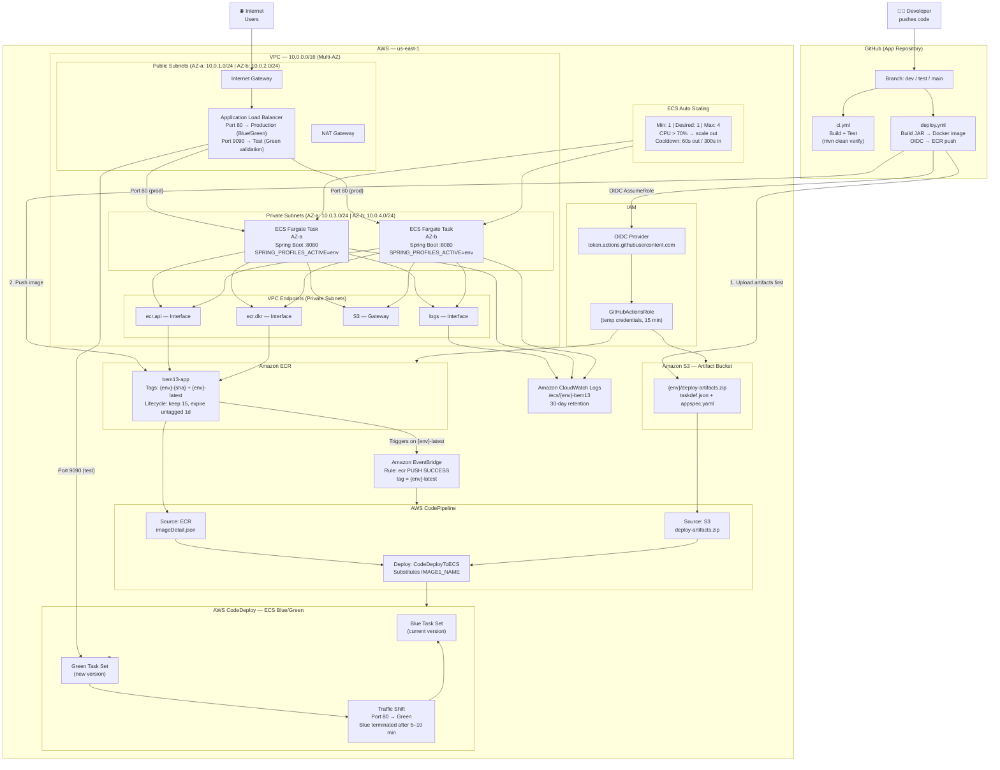
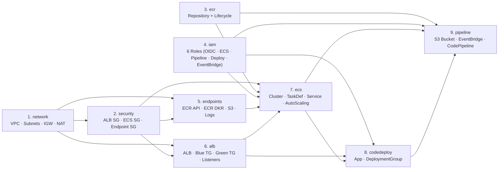
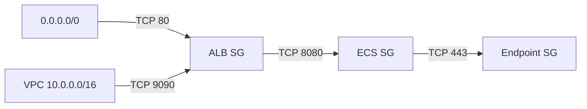
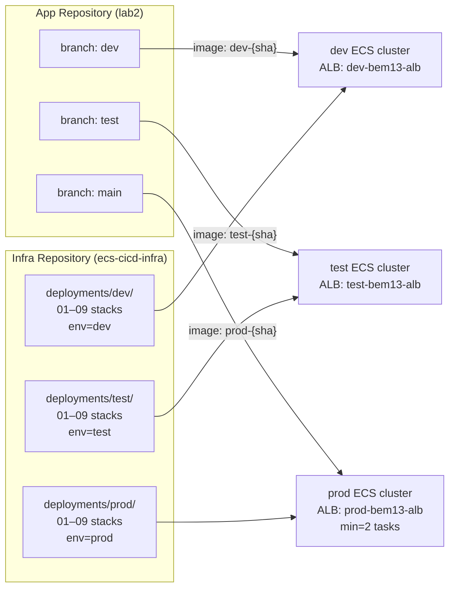

# BEM13 ECS CICD — Network Architecture Diagram

Author: Timothy Nlenjibi | Lab: BEM13 Running Containers on AWS

---

## Full System Architecture

---

## CloudFormation Stack Dependency Chain

---

## Security Group Rules

---

## Three-Environment Deployment Model

